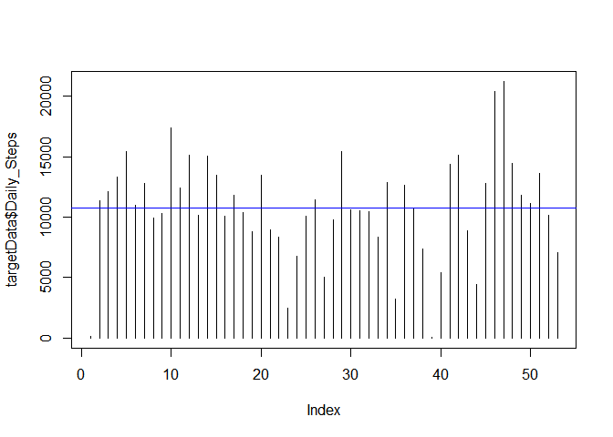

# Reproducible Research: Peer Assessment 1

## Loading and preprocessing the data
- We load the dply library for various subsetting functions.
- We download a fresh copy and unzip the file.
- We place the data in a raw table.
- We move the data to a target data so we can begin manipulating.


```r
library("dplyr")  
```

```
## 
## Attaching package: 'dplyr'
## 
## The following objects are masked from 'package:stats':
## 
##     filter, lag
## 
## The following objects are masked from 'package:base':
## 
##     intersect, setdiff, setequal, union
```

```r
download.file("https://d396qusza40orc.cloudfront.net/repdata%2Fdata%2Factivity.zip", "activity.zip")  
unzip ("activity.zip", exdir= "./data")                 ##  Unzip the file.  
rawData <- read.csv ("./data/activity.csv")             ##  Read the CSV Files into a Raw Location  
targetData <- rawData[complete.cases(rawData),]         ##  Remove NA's  
targetData <- arrange(targetData, date)                 ##  Arrange in Date Order  
```

We begin working on the starting example by making further changes to the data.   
- We remove NA's for Part One.   
- We arrange by Date to making plotting easier later.   


```r
targetData <- rawData[complete.cases(rawData),]         ##  Remove NA's   
targetData <- arrange(targetData, date)                 ##  Arrange in Date Order 
```

## What is mean total number of steps taken per day?
- We convert our factors to dates to make them a little easier to work with.
- We aggregate the daily steps by date, using aggregate to sum the values. 
- Finally we pretty up the column names a bit for clarity and ease of use.
- We also calculate our mean and median for later use in the plot.

```r
targetData$date <- as.Date(targetData$date)                             ##  Convert factors to date format.
targetData <- aggregate(targetData$steps, list(targetData$date), sum)   ##  Builds SUM Aggregate
colnames(targetData) <- c("Date", "Daily_Steps")
avgdlystps <- mean(targetData$Daily_Steps)
meddlystps <- median(targetData$Daily_Steps)
```

### Results - Daily Steps

```r
        plot(targetData$Daily_Steps,type="h")  
        abline(h=avgdlystps)  
        abline(h=meddlystps)  
```

 

```r
        print(c("Average Daily Steps - ", as.character(avgdlystps)))  
```

```
## [1] "Average Daily Steps - " "10766.1886792453"
```

```r
        print(c("Median Daily Steps - ", as.character(meddlystps)))  
```

```
## [1] "Median Daily Steps - " "10765"
```
        
## What is the average daily activity pattern?


## Imputing missing values


## Are there differences in activity patterns between weekdays and weekends

}
