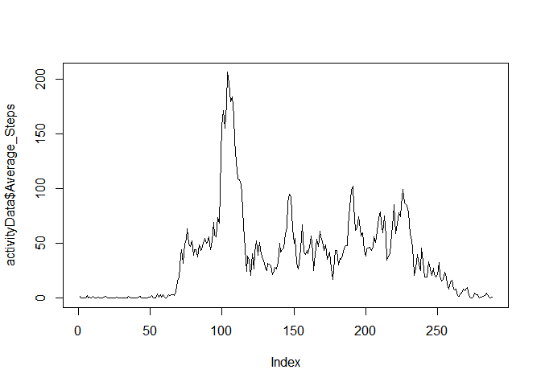
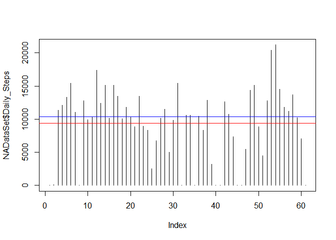

# Reproducible Research: Peer Assessment 1

## Loading and preprocessing the data
- We load the dply library for various subsetting functions.
- We download a fresh copy and unzip the file.
- We place the data in a raw table.
- We move the data to a target data so we can begin manipulating.


```r
library("dplyr")  
```

```
## 
## Attaching package: 'dplyr'
## 
## The following objects are masked from 'package:stats':
## 
##     filter, lag
## 
## The following objects are masked from 'package:base':
## 
##     intersect, setdiff, setequal, union
```

```r
download.file("https://d396qusza40orc.cloudfront.net/repdata%2Fdata%2Factivity.zip", "activity.zip")  
unzip ("activity.zip", exdir= "./data")                 ##  Unzip the file.  
rawData <- read.csv ("./data/activity.csv")             ##  Read the CSV Files into a Raw Location  
targetData <- rawData[complete.cases(rawData),]         ##  Remove NA's  
targetData <- arrange(targetData, date)                 ##  Arrange in Date Order  
```

We begin working on the starting example by making further changes to the data.   
- We remove NA's for Part One.   
- We arrange by Date to making plotting easier later.   


```r
targetData <- rawData[complete.cases(rawData),]         ##  Remove NA's   
targetData <- arrange(targetData, date)                 ##  Arrange in Date Order 
activityData <- arrange(targetData, interval)           ##  Arrange in interval Order
```

## What is mean total number of steps taken per day?
- We convert our factors to dates to make them a little easier to work with.
- We aggregate the daily steps by date, using aggregate to sum the values. 
- Finally we pretty up the column names a bit for clarity and ease of use.
- We also calculate our mean and median for later use in the plot.

```r
targetData$date <- as.Date(targetData$date)                             ##  Convert factors to date format.
targetData <- aggregate(targetData$steps, list(targetData$date), sum)   ##  Builds SUM Aggregate
colnames(targetData) <- c("Date", "Daily_Steps")
avgdlystps <- mean(targetData$Daily_Steps)
meddlystps <- median(targetData$Daily_Steps)
```

### Results - Daily Steps

```r
        plot(targetData$Daily_Steps,type="h")  
        abline(h=avgdlystps, col="Red")  
        abline(h=meddlystps, col="Blue")  
```

 

```r
        print(c("Average Daily Steps - ", as.character(avgdlystps)))  
```

```
## [1] "Average Daily Steps - " "10766.1886792453"
```

```r
        print(c("Median Daily Steps - ", as.character(meddlystps)))  
```

```
## [1] "Median Daily Steps - " "10765"
```
        
## What is the average daily activity pattern?
The average steps for each interval, across all days is listed below.  
-We create a directory and complete preparing the data.
-We plot the average steps for each interval, across all days.
-We find the maximum value and identify the interval that prepares that below.


```r
        activityData <- aggregate(activityData$steps, list(activityData$interval), mean)
        colnames(activityData) <- c("Interval", "Average_Steps")
        plot(activityData$Average_Steps, type="l")
```

 

```r
        print("The interval with the greatest number of steps is averaged across all days is")
```

```
## [1] "The interval with the greatest number of steps is averaged across all days is"
```

```r
        print(as.character(activityData[activityData$Average_Steps==max(activityData$Average_Steps),]))
```

```
## [1] "835"              "206.169811320755"
```

## Imputing missing values
The total number of NA values in the data set are -

```r
        NADataSet <- rawData
        print(c("Total NA values is the dataset are - ", sum(is.na(rawData))))
```

```
## [1] "Total NA values is the dataset are - "
## [2] "2304"
```
The strategy I used to conver NA's was to calculate the median number of steps accross all values  
and replace all NAs with the median value for the given interval.  It writes the dataset to the data 
I then create the updated plot.


```r
        medianNA <- median(NADataSet$steps, na.rm = TRUE)
        NADataSet[is.na(NADataSet)] <- 0
        write.csv(NADataSet, file = "./data/NADataSet.csv")
        
        NADataSet$date <- as.Date(NADataSet$date)             ##  Convert factors to date format.
        NADataSet <- aggregate(NADataSet$steps, list(NADataSet$date), sum)    ##  Builds SUM Aggregate
        colnames(NADataSet) <- c("Date", "Daily_Steps")

        NAavgdlystps <- mean(NADataSet$Daily_Steps)
        NAmeddlystps <- median(NADataSet$Daily_Steps)
        
                
        plot(NADataSet$Daily_Steps,type="h")
        abline(h=NAavgdlystps, col="Red")
        abline(h=NAmeddlystps, col="Blue")
```

 

```r
        print(c("Average Daily Steps - ", as.character(NAavgdlystps)))
```

```
## [1] "Average Daily Steps - " "9354.22950819672"
```

```r
        print(c("Median Daily Steps - ", as.character(NAmeddlystps)))
```

```
## [1] "Median Daily Steps - " "10395"
```
        
        
## Are there differences in activity patterns between weekdays and weekends
